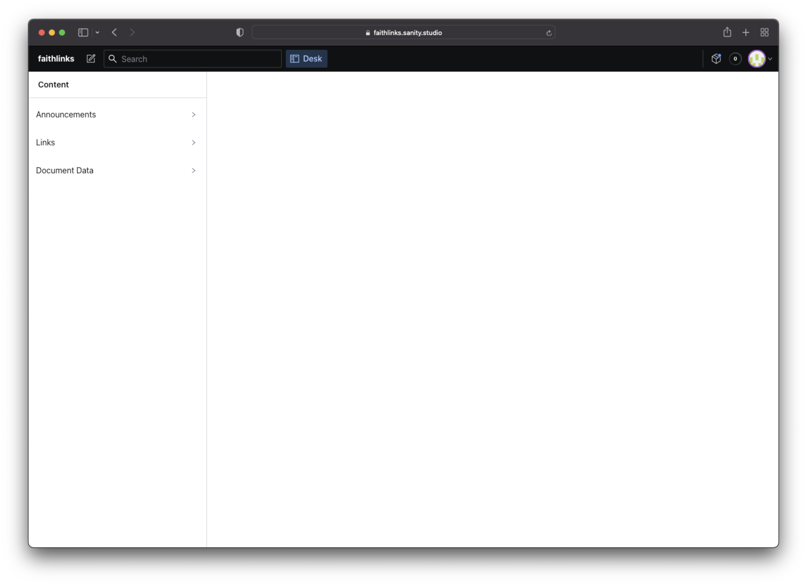
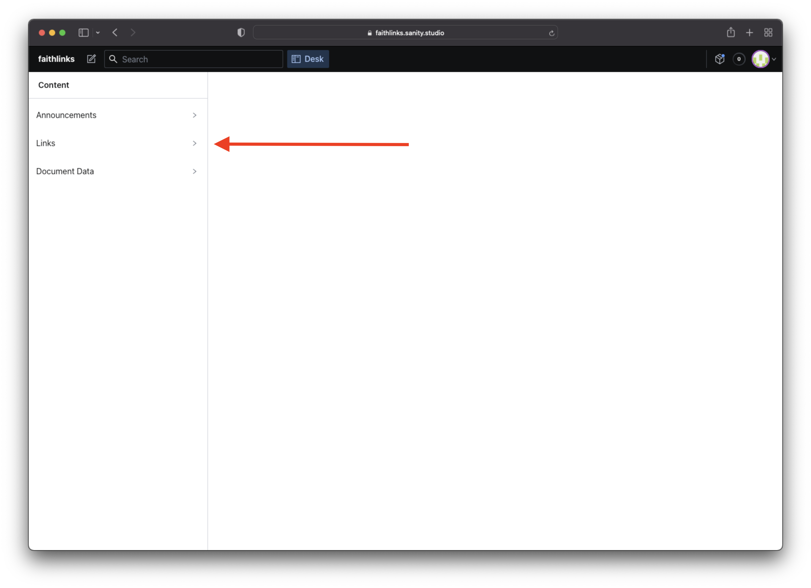
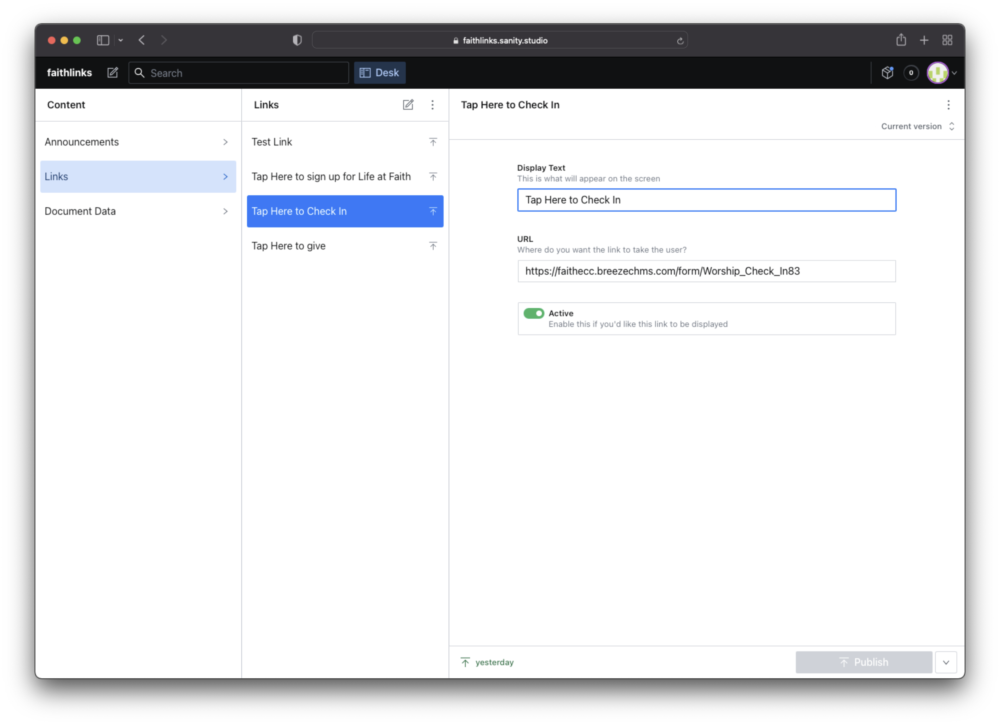
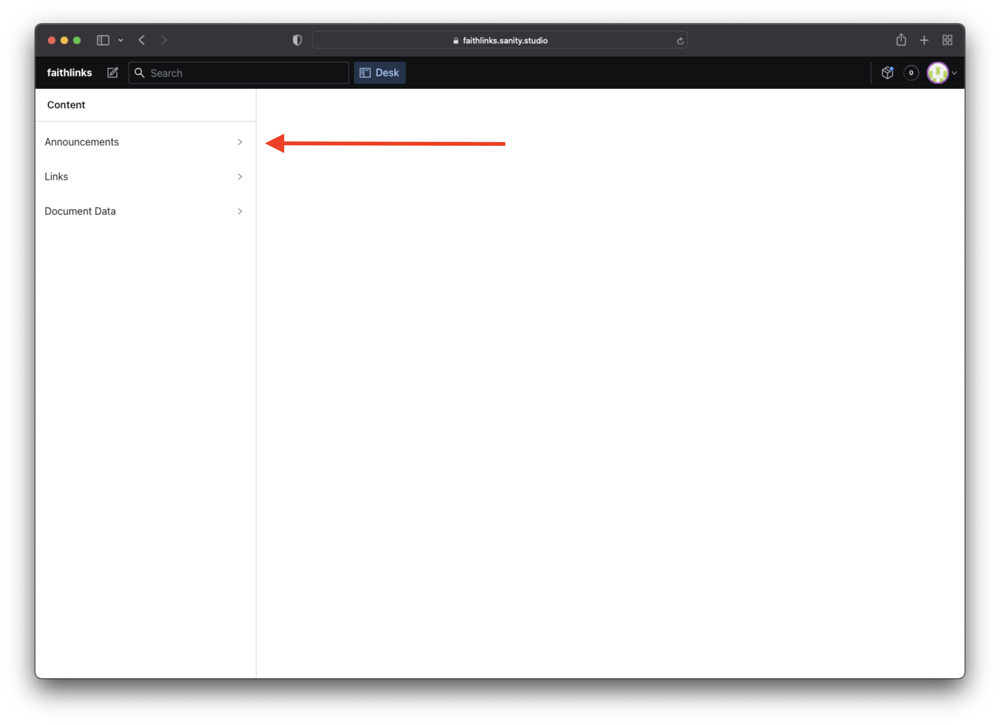
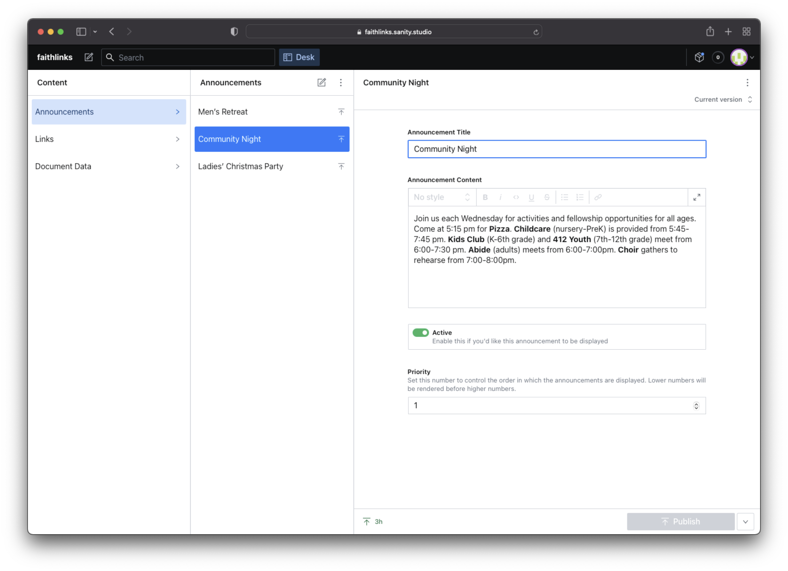

# Digital Bulletin 2.0

## A tool for Faith Covenant Church in Wheaton, IL

### How to edit content

- Gain access to the [Sanity Studio](https://faithlinks.sanity.studio)
- Log in to the Sanity Studio

You should see something like this:

If you want to add, remove, or edit a Link, click on `Links`.

The next column that appears are the links that have been created so far. Click on any of them to edit. You will find the editable fields, along with a toggle switch to either make this link "active" or not in the app. If it is "Active" it will show up, if it is not active, it will not. The reason for this is so that you can keep things around for re-use later, instead of overwriting the same links and losing what you had previously.

The same goes for `Announcements`. Click on Announcements in the far left column. Pre-existing announcements will appear, and you can click on any of them to edit. The `Announcement Content` section has a rich text editor where you can stylize your text, or insert hyperlinks for taking the user to a sign up form.

The same principle applies here. There is an "Active" toggle to control whether or not it will appear in the app. The main reason for this is to save an announcement for re-use later, instead of constantly overwriting the same "announcement" every week.

You will also notice once an announcement is active, a `Priority` input appears. This helps you control the order in which the announcements are displayed. Set it to 1 to display it first, 2 for second, etc.

To save your changes, click the green publish button at the bottom after your changes are made. These changes are made in real time, and will automatically be fetched from the front-facing application.

The live app can be viewed here: https://faithlinks.vercel.app.

Happy Service Planning!

#### Technology Used

- [React](https://reactjs.org)
- [Typescript](https://www.typescriptlang.org)
- [Sanity](https://www.sanity.io)

By [Zack Zboncak](https://zzboncak.github.io/Portfolio/)
